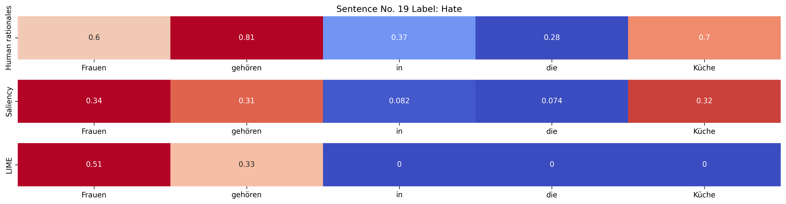

## Explaining BERT-based hate speech detection with LIME and Saliency using Captum

It has been shown that BERT’s domain-specific fine-tuning approaches for hate speech detection are still competitive for hate speech classification (Roy et al., 2023). Although LLMs can also be used for classification tasks, they are trained on a wider domain of tasks and more data. Their predictive power is also tied to the right model instructions and decoding strategies. Roy et al. (2023) confirm that LLMs are sensitive to input variations and struggle in particular with implicit cases of hate speech. This aspect makes it also more difficult to probe LLMs with explainability methods. In contrast, BERT models, as classifiers, are easier to explain.

This notebook's idea is to investigate how well BERT-based hate speech detection is aligned with human judgments of German hate speech. To arrive at plausible explanations, we also need to determine which method, that is, a model agnostic simplification such as LIME or a gradient-based method such as Saliency, works best for our purpose. 

As we can see in the following example, the explainability methods will tell us which tokens influenced BERT's prediction.

### Overview
- Loading and preprocessing Gaze4Hate dataset
- Loading and initializing the BERT model for hate speech detection
- Deriving explanations through attributions from BERT with LIME
- Deriving explanations through attributions from BERT with Saliency
- Evaluating the results (human vs. BERT rationales)
- Visualizing the results (alignment)